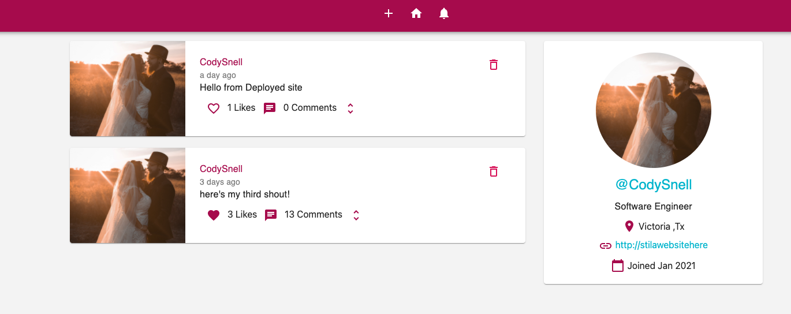
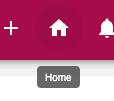

# Shouts!

A fully featured social media app, that allows all users to interact with each other just by signing up!

## Tech Used

- HTML
- CSS3
- React.js
- Node.JS
- Express.JS
- Google Firebase
- Material UI
- Dayjs
- Redux
- Axios
- Postman

## Screenshots

#### Home Page

#### Profile Page

#### Edit Details

#### Every Icon Has A ToolTip to Help New Users

#### Notifications

#### Error Handling

# Website is Now LIVE!

# [Click Here](https://socialportfolio-155d8.web.app/) to see the app in action!

##### Future Enhancements

###### \* Deploy to Perosonal Domain

###### \* Update code to include async functions
